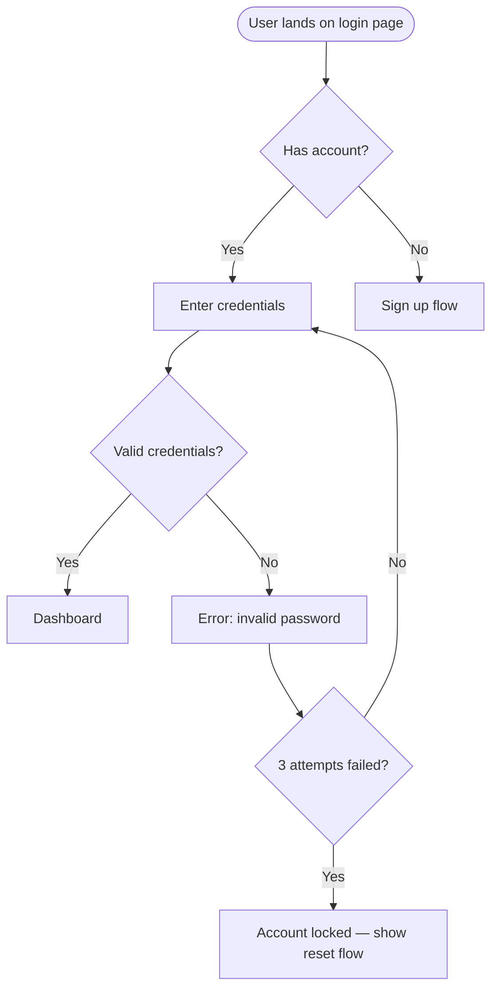

# User Flow

> If you see unfamiliar placeholders or need to check which tools are connected, see [CONNECTORS.md](../../CONNECTORS.md).

Generate clear, annotated user flow diagrams that map how users move through a product — not just happy paths, but error branches, decision points, and dead ends too.

## Usage

```
/flow $ARGUMENTS
```

---

## Context Gathering (REQUIRED)

Before generating, confirm:

| Context | Why it matters |
|---------|---------------|
| **User goal** | What is the user trying to accomplish? (One goal per flow) |
| **Entry point** | Where does the user start? (Landing page, email link, nav item…) |
| **Success state** | What does "done" look like for the user? |
| **Scope** | End-to-end journey, or a specific sub-flow? |
| **Errors to include** | Which failure paths are important to map? |

If a Figma link is provided and **~~design tool** is connected, infer the flow from existing screens.

---

## Flow Diagram Standards

### What a Good Flow Includes

Every flow must show:

1. **Entry points** — where users arrive from (not just "start")
2. **Decision points** — every fork (authenticated? has data? completes step?)
3. **Happy path** — the ideal uninterrupted journey
4. **Error branches** — at minimum: auth failure, validation failure, empty state, network error
5. **Dead ends** — screens users get stuck on (flag these as design problems)
6. **Exit points** — where users leave the product (intentional or abandoned)
7. **System actions** — what happens in the background (API call, email sent, etc.)

### Node Taxonomy

Use consistent shapes and labels:

| Shape | Meaning | Label style |
|-------|---------|-------------|
| Rounded rectangle | Screen / page | Screen name |
| Diamond | Decision point | Question format: "Is user logged in?" |
| Rectangle | System action | Action verb: "Send confirmation email" |
| Oval / pill | Entry / exit | "Start", "End", "User leaves" |
| Parallelogram | User input | "User enters email" |

### Annotation Requirements

Every non-obvious transition gets a label:
- Condition: "If valid token" / "If invalid"
- Trigger: "On form submit" / "On back button"
- System: "After 2s delay" / "On API success"

Dead ends and error paths must be visually distinct — use dashed lines or a different color notation.

---

## Output Formats

Generate in the format most useful for the context:

### Mermaid (default — renders in Notion, GitHub, Linear, most wikis)



### SVG HTML artifact (for visual presentation or stakeholder review)

A rendered, styled flow diagram as an HTML artifact — cleaner than raw Mermaid for presentations.

### Structured text outline (for accessibility or documentation)

Numbered step-by-step description of the flow, suitable for pasting into specs.

---

## Flow Critique (Run After Generating)

After generating the flow, automatically flag:

### Dead Ends
Any path that reaches a terminal node that isn't a success state or explicit exit. These are design failures — the user has nowhere to go.

### Missing Error Paths
Decision points with only one branch (the happy path). Every decision needs at least two outcomes.

### Too Many Steps
If the happy path has more than 7 steps, flag it. Research shows user drop-off increases significantly beyond 5–7 steps (Miller's Law applied to flows).

### Unmapped Re-entry Points
Flows that start users over from the beginning instead of resuming — especially in multi-step forms and onboarding.

### Disconnected Screens
Screens that appear in the flow but have no visible entry path. How did the user get there?

---

## Flow → Wireframe Bridge

After mapping the flow, offer to generate wireframes for key screens:

> "I've mapped [N] screens in this flow. Want me to wireframe the most complex one — [screen name]? Or run `/wireframe [screen]` yourself to start."

This closes the research → flow → wireframe pipeline.

---

## If Connectors Available

If **~~design tool** (Figma) is connected:
- Infer existing flows from screen names and components
- Export the flow diagram as a Figma file or FigJam board

If **~~project tracker** is connected:
- Reference tickets linked to each screen in the flow
- Create sub-tasks for screens that need wireframing or design

If **~~knowledge base** is connected:
- Pull existing journey maps or user research to validate the flow against real behavior
- Publish the completed flow to your documentation

---

## Tips

1. **One goal per diagram** — Trying to map all flows in one diagram creates a hairball. Split by user goal.
2. **Name screens, not actions** — "Login screen" not "User logs in" — keep nodes as places, transitions as actions
3. **Map what exists, then what should exist** — Auditing the current flow before designing the ideal one reveals the real problems
4. **Show to a non-designer** — If they can't follow the flow without explanation, it's too complex
